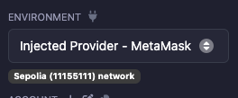
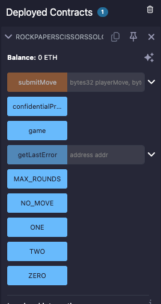

# FHEVM Rock-Paper-Scissors

A fully homomorphic encryption (FHE) implementation of Rock-Paper-Scissors on Ethereum, where moves remain encrypted throughout the game and only the final winner is revealed.

## Architecture

Players call the `submitMove` function with their encrypted move. They can then call `determineRoundWinner` which calculates each round's winner and updates the scores. After 3 rounds, the `getWinner` function can be called to reveal the winner.

On the solo version, since there's no other player, the flow is simplified: the player just calls `playRound` with their encrypted move, and the "computer" move is generated on-chain using `FHE.randEuint8()`. 

## Code walkthrough

Here's a little video of me [walking through the code](https://streamable.com/latap6)

## Prerequisites

- `node.js`
- `npm`, `yarn`, `bun`, etc (I used `bun`)
- `hardhat`

## Quick Start

### 1. Installation

Clone and install dependencies:

```bash
git clone https://github.com/signorecello/zama_rps.git
cd zama_rps
bun i
```

### 2. Compile Contracts

There are two contracts: `RPS.sol` and `RPSsolo.sol`. Both can be compiled with the same command:

```bash
bun run compile
```

Running tests will compile the contracts too.

### 3. Run Tests

Run the tests:

```bash
bun run test
```

There are a few basic tests for each version of the game, with a few unhappy scenarios and a few runs of the complete game. These work by deploying all the needed contracts on a `hardhat` local node.

## Running on Sepolia

In order to run the project on Sepolia, you'll need to have a wallet with some Sepolia ETH. You can get some from faucets such as [Alchemy](https://www.alchemy.com/). Then, set the `MNEMONIC` and `INFURA_API_KEY` hardhat variables:

```bash
npx hardhat vars set MNEMONIC
npx hardhat vars set INFURA_API_KEY
```

These will ask you for your testnet wallet's mnemonic and Infura API key, respectively (you can use other RPC provider but mind that you need to change it in `hardhat.config.ts`).

`hardhat.config.ts` will use these variables to connect to the Sepolia network, and you can deploy the contracts using:

```bash
bun run deploy:sepolia:solo
bun run deploy:sepolia:two
```

This will deploy the `RPSsolo` and `RSP` contracts to the Sepolia network and hopefully tell you where it lives.

## Playing the game on Remix IDE

If you want to check that the game works correctly, you can deploy it on Sepolia using the Remix IDE. Just copy the contract into a new [Remix project](https://remix.ethereum.org/), compile it, and connect it with the injected provider, like so:



Deploy with one of the accounts and sign the transaction on the wallet (I'm using Metamask). After it goes through, you get the deployment like so:



Now you need an encrypted move to actually play the game. I've coded a little helper to do that, just run `bun run calculate <game address> <your address> <your move>` for example `bun run calculate 0x55a32B51008fC5911a6C3e49BaEe3386Eb866E3c 0x94c94b89b14073e9ed6670f92ce6ec51a6c25581 rock`


## Frontend Integration Guide

After deploying the contracts, you can integrate them into a React dApp using the Zama FHEVM Relayer SDK. Install it using:

```bash
bun i @zama-fhe/relayer-sdk
```

More on that on the [official documentation](https://docs.zama.org/protocol/relayer-sdk-guides/development-guide/webapp#using-npm-package) for web integration.

If you're using `wagmi` or similar, here's a quick example (untested):

```typescript
import { initSDK, createInstance, SepoliaConfig } from '@zama-fhe/relayer-sdk/web';
import { useEffect, useState } from 'react';
import { useReadContract, useAccount, useWriteContract } from 'wagmi';

const CONTRACT_ADDRESS = '0x...'; // replace with whatever your contract address is

// WASM needs to be loaded on a separate step
export function useInitFhevm() {
  const [fhevm, setFhevm] = useState(null);
  const [isLoading, setIsLoading] = useState(true);
  const [error, setError] = useState(null);

  useEffect(() => {
    async function init() {
      try {
        await initSDK();
        const instance = await createInstance({
          ...SepoliaConfig,
          network: window.ethereum,
        });
        setFhevm(instance);
      } catch (err) {
        setError(err);
      } finally {
        setIsLoading(false);
      }
    }
    init();
  }, []);

  return { fhevm, isLoading, error };
}

// assuming a one-player game, two player game should be similar
export function RPSGame() {
  const { address } = useAccount();
  const { writeContract } = useWriteContract();

  const { fhevm, isLoading, error } = useInitFhevm();
  if (isLoading) return <div>Loading FHEVM...</div>;
  if (error) return <div>Error: {error.message}</div>;

  // a function to play a round, you'd call this on the return of a button click or something
  async function playRound(move: number) {
    if (!fhevm || !address) return;

    const input = fhevm.createEncryptedInput(CONTRACT_ADDRESS, address);
    input.add8(move);
    const { handles, inputProof } = input.encrypt();

    // Submit encrypted move to contract
    writeContract({
      address: CONTRACT_ADDRESS,
      abi: rpsSoloAbi,
      functionName: 'playRound',
      args: [handles[0], inputProof],
    });
  }

  async function revealWinner() {
    if (!fhevm) return;

    // Read encrypted winner from contract
    const encryptedWinner = await readContract({
      address: CONTRACT_ADDRESS,
      abi: rpsSoloAbi,
      functionName: 'getWinner',
    });

    // Decrypt using FHEVM instance
    const winner = await fhevm.decrypt(CONTRACT_ADDRESS, encryptedWinner);

    // winner: 0n = tie, 1n = player, 2n = computer
    console.log('Winner:', winner);
  }
}
```
